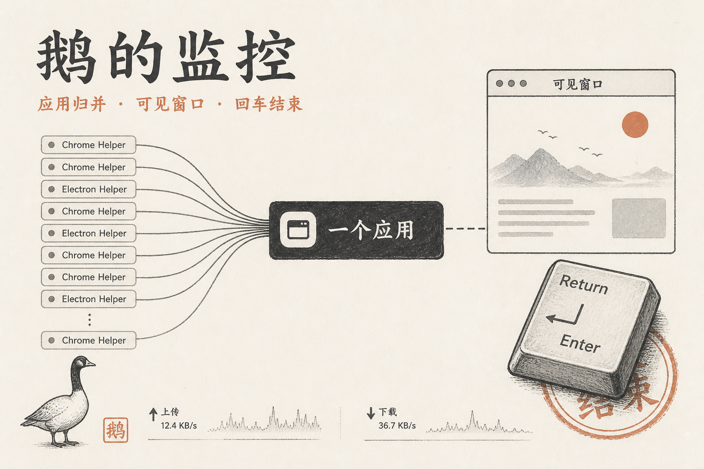

# 鹅的监控

按应用归并 Electron / Chrome Helper。搜到回车就杀，输入 `8101` 能找到谁占了这个端口。

## 大功能

- **应用归并 Helper**：一行一个应用，左右键展开 GPU / 标签页 / 网络服务。
- **搜到回车就杀**：不用先点列表，也不弹确认，整组一起结束。
- **按端口找进程**：搜 `8101` 找到占用者，名称旁标正在听的端口。
- **可见窗口与真实网速**：界面分类只留屏幕上看得见的应用；网络分类看此刻上下行。
- **拒绝 PID 复用**：结束前用快照再验一遍，不会杀到后来占用同一个 PID 的进程。

## 系列

## 同系列

- [鹅的笔记](https://github.com/eachann1024/goose-notes)
- [鹅的书签](https://github.com/eachann1024/goose-mark)
- [鹅的监控](https://github.com/eachann1024/goose-monitor)
- [鹅的验证](https://github.com/eachann1024/goose-2fa)
- [鹅的 Agent](https://github.com/eachann1024/eachann1024)

## 不做什么

不是业务监控大盘，不管订单库存。它管的是你机器上正在跑的进程。

开发说明见 [DEVELOP.md](DEVELOP.md)。
