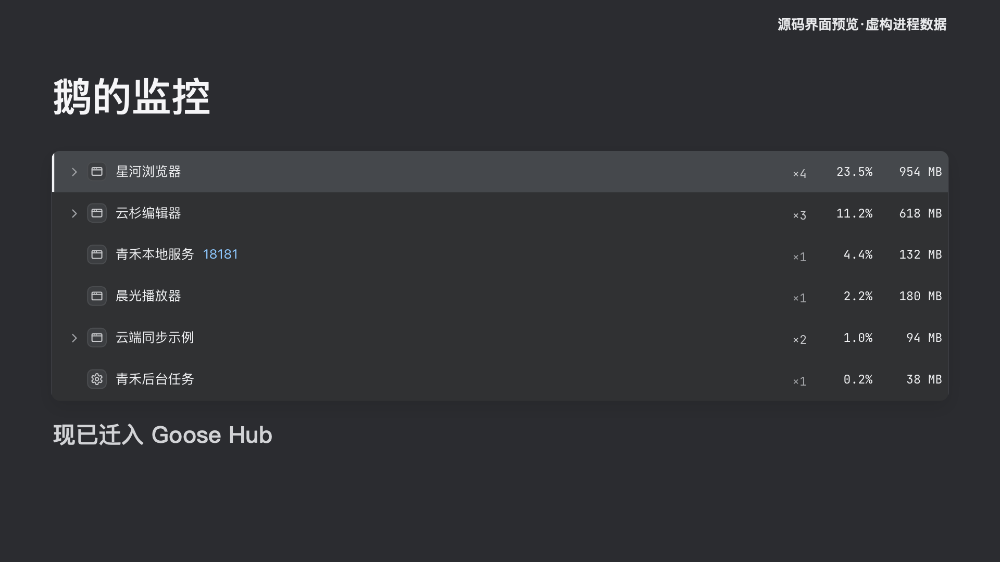

> **已迁入 [Goose Hub](/Users/eachann/Work/goose-hub)。** 数据目录为 `~/.config/monitor`。本仓库的 uTools 版以 tag `utools-last` 冻结，需要回滚时检出该 tag。

# 鹅的监控

按应用归并 Electron / Chrome Helper。搜到回车就杀，输入 `8101` 能找到谁占了这个端口。

## 视频介绍

[观看／下载 MP4](https://github.com/eachann1024/goose-monitor/raw/refs/heads/main/docs/media/product-intro-zh.mp4) · 中文旁白 · 1080p · 41 秒

**源码界面预览·虚构进程数据**。展示应用与 Helper 归组、资源排序、虚构端口搜索及界面与网络分类。基于 goose-monitor `a4140661c490059c122061a6099033e29ec7832e` 与 Hub `f298eb8936e57073f2e34bd59bf211e8ee9ba66a`；未采样或结束真实进程，原生确认与快照复核依据源码说明。

## 大功能

- **应用归并 Helper**：一行一个应用，左右键展开 GPU / 标签页 / 网络服务。
- **搜到回车就杀**：不用先点列表，也不弹确认，整组一起结束。
- **按端口找进程**：搜 `8101` 找到占用者，名称旁标正在听的端口。
- **可见窗口与真实网速**：界面分类只留屏幕上看得见的应用；网络分类看此刻上下行。
- **拒绝 PID 复用**：结束前用快照再验一遍，不会杀到后来占用同一个 PID 的进程。

## 同系列

- [鹅的笔记](https://github.com/eachann1024/goose-notes)
- [鹅的书签](https://github.com/eachann1024/goose-mark)
- [鹅的监控](https://github.com/eachann1024/goose-monitor)
- [鹅的验证](https://github.com/eachann1024/goose-2fa)
- [鹅的 Agent](https://github.com/eachann1024/eachann1024)

## 不做什么

不是业务监控大盘，不管订单库存。它管的是你机器上正在跑的进程。

## 许可

本项目以 [MIT 许可证](LICENSE) 开源，版权所有 © 2026 eachann1024。
